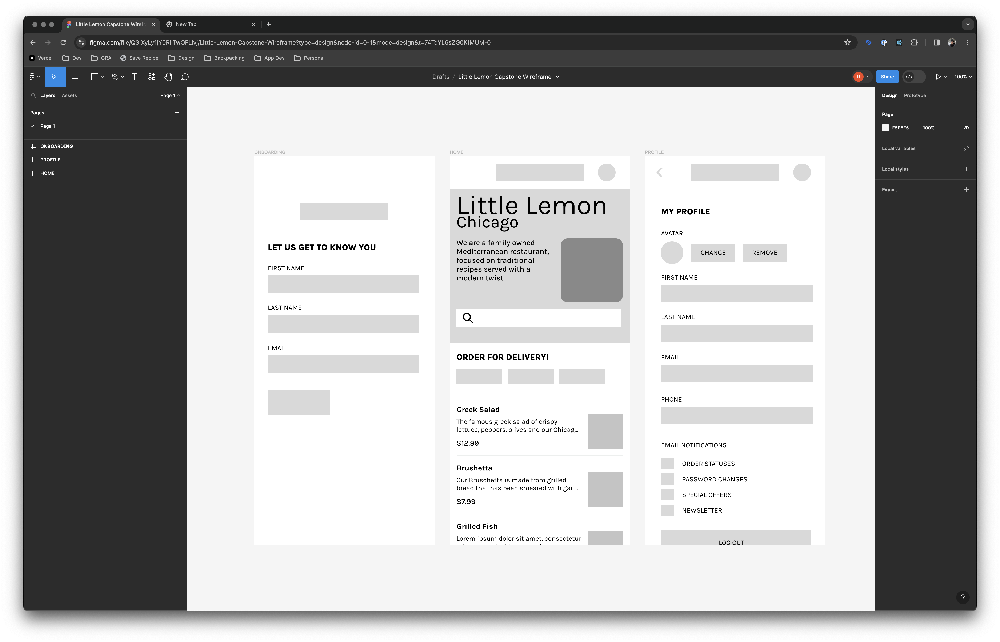

# Little Lemon Capstone Project
META React Native Certification via Coursera

Author: Robert Wade

---

### Installation
To install necessary dependencies first run:
```bash
npm install
```

### Running in the XCode Simulator
To run the app in the XCode device simulator:
```bash
npm run start
```
You will be given a prompt in Expo to choose a simulator or scan a QR code to view in Expo on your device.

---

### Wireframes

The following wireframes are included as part of the project Rubric:



---

### Project Rubric

Following is the grading review criteria:

1) Is there a wireframe design upon which the actual screens in your mobile app are based?

2) Are you greeted with an Onboarding screen when the app is opened for the first time, with a prompt to enter your personal details?

3) Does the Onboarding screen feature a Next button that is only enabled when the details are entered?

4) Does the layout of the Home screen contain the following sections? header, hero, menu breakdown, and the food menu list.

5) When accessed, is the Profile screen populated with the data you entered during onboarding?

6) Are saved changes in the Profile screen retained when the app is restarted?

7) Does clicking the Log out button clear all data from the Profile screen?

8) Does the app feature stack navigation that allows you to access the previous screen using the Back button?

9) Does the hero section contain a brief description of Little Lemon restaurant and a search bar?

10) Does the menu breakdown section feature selectable menu categories?

11) Does the food menu list section display a summarized view of the menu items?

12) Can you suggest any ways in which this app could be improved?


